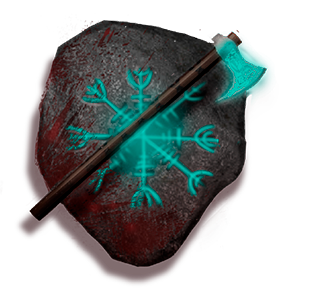

# Feed The Madness

Norway in the 80s, a group of teenagers who enjoy a trip to the forest are suddenly assaulted by a mysterious ancient-looking being, which forces them to flee to avoid being killed.

In Feed The Madness you must chase the intruders from your territory to increase your madness and stay on your feet, it is an endless runner with horror aesthetics in which you explore how it would be in the role from which you should flee.

This is a game being developed by students from <a href="https://www.imagecampus.edu.ar/">Image Campus</a>

   

## Credits

- Mauro Mendoza "Programmer"
- Juan Ignacio Ranedo "Artist"
- Matias Leguizamo Boan "Artist"
- Dante Poggio "Voiceover and implementation"
- Hernán Marrone "Musical composition"
- Sebastián Martínez "Sound design and implementation"
- Tomas Hirsch "Tester"
- Ignacio Carrizo "Tester"
- Gabriel Manrique "Tester"

This game was also possible thanks to the support of these professors:

- **Sergio Baretto**
- **Federico Barra**
- **Ramiro Cabrera**
- **Lucía Inés Patetta**
- **Nazareno Rivero**
- **Eugenio Taboada**

## Links

Download it from itch.io: https://maurus.itch.io/feed-the-madness

## Contributing

Bug reports and contributions can be made via the [Github repository](https://github.com/mauromendozacp/Feed-The-Madness).

Developed with Unity 2019.4.22f1